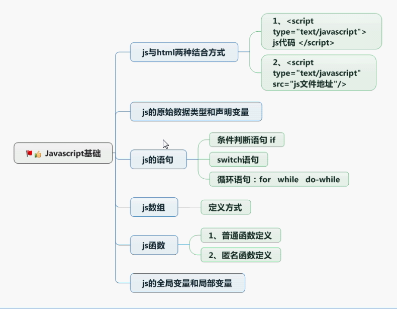
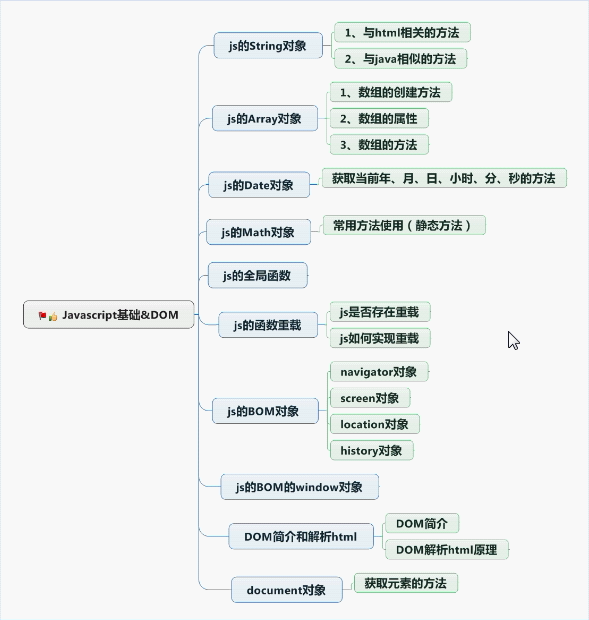

# JS

[TOC]




## 

    ECMAScript  语法
    bom         浏览器模型
    dom         文档模型

## 一、ECMAScript

#### 1.js和html的结合方式
    1.  <script type="text/javascript"> js代码 </script>
    2.  <script type="text/javascript" src="js路径"> </script>
    3.  <script src="js路径"> </script>

####  2.js的数据类型
    string number boolean null undifined
    var定义

####  3.js语句
    if
    swtich
    for
    while
    do-while

#### 4. js的运算符
    字符串操作
    + 拼接字符串
    - 执行数学运算
    
    == 和 ===
    == 判断值
    === 判断值和类型

####  5.js的数组
```javascript
// 数组定义
var arr0 = [1,2,"3"];
// 数组长度
var arr1 = new Array(9)
// 元素1，2，3
var arr2 = new Array(1,2,3); 
// 通过下标设置元素
arr1[0] = 1;
arr1[1] = 2;

//遍历
arr.forEach(function (ele,index,array){
    console.log(ele,index,array);
});
```

####  6.js的函数
    定义方式1:
    function methodName(a,b) {
    
    }
    
    定义方式2:
    var methodName = function(a,b){
    
    }
        
    定义方式3:
    var methodName = new Function("a,b","方法体和返回值");

####  7.script标签位置
    放在body后面

#### 8. js中的对象使用
```javascript
// String Array Date Math使用
// 字面量创建对象
var person = {
    name:"张三",
    age:10,
    eat:function (){
        console.log("吃饭");
    }
} 
person.eat();
// 点语法访问属性
console.log(person.name);
// 属性访问的另一种方式
console.log(person["name"])
// 遍历对象的属性
for (var key in person){
    console.log(key);
}
```

#### 9 .js的全局函数
    1.eval(code) 执行代码字符串
    var code = "alert('哈哈哈');"
    eval(code);
    
    2.url编码解码
    encodeURI()
    decodeURI()
    
    3.判断是否为数字
    isNaN(str);
    
    4.转换字符串为数字
    parseInt(num);

#### 10 多参数传递

```javascript
function add(){
    var sum = 0;
    for (var i=0;i<arguments.length;i++){
        sum += arguments[i];
    }
    alert(sum);
}

add(100,200,300,400,500,600);
```

####11 函数作为参数使用（用做回调）

#### 12 函数作为返回值使用 


## 二、bom 浏览器对象模型

    1.navigator属性
     userAgent
     product
     appVersion
     appName
     appCodeName
     language
     systemLanguage
     userLanguage
     mimeTypes
     platform
     plugins
     onLine
     cookieEnabled
    
    2.screen属性
     width
     height （屏幕高度）
     availHeight（出去任务栏的高度）
     availWidth
     pixelDepth
     colorDepth
    
    3.location属性
    href(获取完整的URL路径)(设置跳转地址 location.href="xx.html")
    hash
    port
    host
    hostname
    pathname
    protocol
    search
    target
    reload()
    replace(url)
    
    4.history方法
     back()
     forward()
     go(value) value 1下一个页面 -1上一个页面
    
    5.window对象
     // 窗口处理
     confirm() 确认取消弹框 （不用）
     prompt()  输入信息弹框 （不用）
     scrollTo()
     close()
     open()
     alert()
     createPopup()
     onload 页面加载完毕执行
     onunload 页面关闭后触发该事件
     onbeforeunload 页面关闭前触发该事件
     
    6.定时器
     // 多次执行
     setInterval()
     clearInterval()
     // 执行一次
     clearTimeout()
     setTimeout()
     opener 获取打开这个window的对象
     
    7.元素位置
    element.offsetTop 
    element.offsetLeft
    element.offsetWidth
    element.offsetHeight
    
    // 内容位置
    element.scrollHeight
    element.scrollTop 
    element.scrollLeft
    element.scrollWidth

## 三、dom 文档对象模型

####  组成：
    <p id="idName"> 哈哈哈哈 </p>
    1.document 整个html文档
    2.element 标签属性
    3.文本对象

#### 1.document 整个html文档
```javascript
// 获取节点
document.getElementById(); // 元素
document.getElementsByClassName(); // list
document.getElementsByName(); 
document.getElementsByTagName(); // list  

// 修改节点内容 innerText在火狐低版本浏览器不支持，需要使用textContent
document.getElementsByClassName("xm_a")[0].innerText = "甄姬";
// 设置标签的HTML文本 文本可以为标签
document.getElementById("idName").innerHTML = "<br>aaaaaaa</br>";
```

​    
#### 2.element 标签对象(用于设置标签的属性id、class、name等)
```javascript
<input type="button" value="修改" id="btn" score="100"/>
<script>
    document.getElementById("btn").onclick = function() {
        this.type = "date";
        alert(this.getAttribute("type"));
    }
</script>

// 1.获取，设置标签的属性
document.getElementById("btn").type = "date"; 
document.getElementById("btn").value = "哈哈"; 
document.getElementById("btn").id = "idChange";

// 2.获取修改自定义属性的唯一方式
li.getAttribute("score")
li.setAttribute("score","50")

// 3.移除标签属性
li.removeAttribute("score")

```

#### 3.节点
```javascript
/**
    nodeValue 节点内容
    nodeName 节点名称（大写）
    nodeType 节点类型（数字 1标签 2元素 3内容）
*/

// 1. 位置节点
li.firstChild // 可以是标签，内容，属性
li.firstElementChild // 只能是标签  ie8不支持
li.lastChild
li.lastChildElementChild //   ie8不支持
li.childNodes // 获取所以子节点（只包括儿子
li.children // 所以子元素（包括儿子，孙子...等等）
li.parentNode
li.nextSibling  // 指向后面一个兄弟节点
li.nextElementSibling   // ie8不支持
li.previousSibling  // 指向前面一个兄弟节点
li.previousElementSibling    // ie8不支持

// 2.添加节点的三种方式
// 第一种
document.write("<p>平心而论<p/>");
// 第二种
li.innerHTML = "<input type='button' value='修改' id='btn' score='100'/>"; // 双引号中的字符串使用'单引号，双引号中的变量使用 "+变量+"
// 第三种
var li = document.createElement("li");
li.innerText = "ddddd";
div.appendChild(li);

// 插入节点
document.insertBefore()
// 删除节点
document.removeChild()
// 替换节点
document.replaceChild()
// 添加节点
li.appendChild();
// 创建节点
document.createElement();

// 创建节点
var li = document.createElement("li");
var text = document.createTextNode("name");

```

#### 4. 绑定／解绑 事件

```javascript
// 事件绑定
// 1.addEventListener 谷歌火狐IE11支持，IE8不支持， this代表绑定事件对象
// 2.attachEvent	谷歌火狐IE11不支持，IE8支持，	this代表window
// 3.element["on"+"click"]

// 兼容代码
var element = document.getElementById("btn");
var func = function(){
    console.log("haha");
};
if(element.addEventListener){
    element.addEventListener("click",func,false);
} else if (element.attachEvent){
    element.attachEvent("click",func);
} else {
    element["on"+"click"]=func;
}


// 事件解绑
// 1.onclink = null;
// 2.removeEventListener type,fun,false 3个参数必须相同
// 3.detachEvent	type,fun必须相同

// 兼容代码
if(element.removeEventListener){
    element.removeEventListener("click",func,false);
} else if(element.detachEvent){
    element.detachEvent("click",func);
} else {
    element["onclick"] = null;
}
```


#### 5.阻止事件冒泡

```javascript
var func = function(event){
    if(event.stopPropagation){
        event.stopPropagation();
    } else if(window.event.cancelBubble){
        window.event.cancelBubble = true;
    }
};
```


##  四、JS高级

```
原型-原型链-继承-构造函数继承-组合继承-拷贝继承
```

####1.创建对象的三方式

```javascript
// 1.对象的类型为Object
function Student(name,age){
    var student = new Object();
    student.name = name;
    student.age = age;
    student.eat = function(){console.log(吃饭了);}
    return student;
}
// 2.对象的类型为Object
var animal = {
    name:"橘喵",
    age:10,
    eat:function (){
        console.log("吃饭");
    }
}
// 3.对象的类型为Person
function Person(name,age){
    this.name = name;
    this.age = age;
}
```


#### 2.利用原型共享内存空间

```
// 所以的Person实例对象共享study方法，相当于oc中的类方法
Person.prototype.study = function(){
    console.log("吃饭了");
}
```


#### 3.原型链

```
instance._proto_  -----> Class.prototype 
Class._proto_ -----> Object.prototype
Object._proto_ 为 null
```


#### 4.bind call apply使用

```javascript
// 学生
function Student(name,age){
    this.name = name;
    this.age = age;
    this.eat = function(){
        console.log("吃吃吃");
        console.log(this.name);
    };
}

// 人
function Person(name,age){
    this.name = name;
    this.age = age;
}

var student = Student("小明",20);
var person = new Person("小米",18);
// call 与 apply使用 区别 call(object)
student.eat.call(person);
var funcEat = student.eat.bind(person);
```


#### 5.数组排序

````javascript
var datarray = [3,10,90,70,40];
datarray.sort(function(a,b){
    if(a>b){
        return 1;
    } else if(a==b){
        return 0;
    } else {
        return -1;
    }
});
````

#### 6.作用域

```java
// 1.js中没有块级作用域
// 2.函数中定义的变量为局部变量，外部不能使用
```

#### 7.闭包

```javascript
// 作用：保存数据，延长变量存活时间
```


#### 8.沙箱

```javascript
// 沙箱即自调用函数，沙箱内 不影响外部环境
// 沙箱1
(function(){

}());
// 沙箱2
(function(){

})();
```

