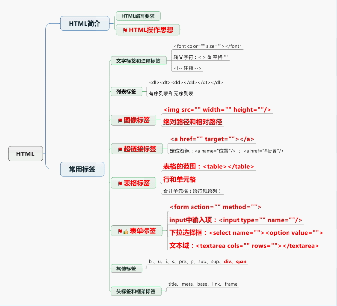

# JavaWebNotes

### 一、HTML 超文本标记语言-网页语言
#### ——规范：
> 1.一个HTML文件要有开始和结束标签 <html> </html>

> 2.HTML包含头尾两部分

    (1). <head> 设置相关信息</head>
    (2). <body> 页面内容</body>
    (3). 标签有开始要有结束
    (4). 不区分大小写
    (5). 有些标签没有结束标签，在标签内结束   

#### ——标签
#### 1.标题标签
    //(范围1～6)
    <h1>标题标签</h1>
#### 2.水平线标签
    

#### 3.列表标签
	<dl>
          <dt>成都</dt>
          <dd>武侯区</dd>
          <dd>高新区</dd>

          <dt>深圳</dt>
          <dd>宝安区</dd>
          <dd>南山区</dd>
      </dl>

#### 4.有序列表标签
        <ol type="a">
            <li>武侯区</li>
            <li>高新区</li>
            <li>天府新区</li>
        </ol>
#### 5.无序标签
       <ul type="square">
            <li>武侯区</li>
            <li>高新区</li>
        </ul>
#### 6.图像标签
	
        路径：
            1.绝对路径
            2.相对路径
               文件夹下层的目录
            <../image.png> 文件夹上层目录
#### 7.链接标签
    // 链接资源
    <a href="资源路径" target="_blank" >百度一下</a>
        target：打开方式，默认当前页面
                — _blank: 新窗口打开
                — _self: 当前页打开，默认
    <a href=“#" target="_blank" >百度一下</a> #代表不需要连接到任何地址
    
    // 定位资源
    <标签 id="top">顶部</标签> 标记顶部位置
    <a href="#top"> 回到顶部</a> 链接到顶部

#### 8.原样输出
    <pre> 内容原样输出 </pre>
    <pre>
    - (instancetype)initWithStyle:(UITableViewCellStyle)style reuseIdentifier:(NSString *)reuseIdentifier
    {
        self = [super initWithStyle:style reuseIdentifier:reuseIdentifier];
        if (self) {
            _textField = [[BXTextField alloc] init];
            _textField.keyboardType = UIKeyboardTypeNumberPad;
            [self.contentView addSubview:_textField];
    }
        return self;
    }
    </pre>

#### 9.表格标签
    <table  cellspacing="0" bgcolor="#faebd7" border="1" borderColor="red" width="500" height="300">
        <!--标题-->
        <caption> 人员信息 </caption>
        <tr align="center">
            <td colspan="4">人员信息</td>
        </tr>
        
        <!--th表头标签 加粗且居中-->
        <tr align="center">
            <th> 姓名 </th>
            <th> 年龄 </th>
            <th> 性别 </td>
            <th> 年级 </th>
        </tr>

        <tr  align="center">
            <td> 李四 </td>
            <td> 25 </td>
            <td> 女 </td>
            <td rowspan="3"> 大一 </td>
        </tr>

        <tr align="center">
            <td> 王五 </td>
            <td> 39 </td>
            <td> 男 </td>
        </tr>

        <tr align="center">
            <td> 赵六 </td>
            <td> 40 </td>
            <td> 不详 </td>
        </tr>
    </table>

#### 10.表单标签

    <form action="1.html" method="post">

        手机号码：<input type="text" name="phoneNumber"/>
         

        密码：<input type="password" name="passWord"/>
         

        性别：<input type="radio" name="sex" value="women" checked="checked"/>女 <input type="radio" name="sex" value="man"/>男
         

        爱好：<input type="checkbox" name="love" value="a"/>羽毛球
            <input type="checkbox" name="love" value="b"/>蓝球
            <input type="checkbox" name="love" value="c"/>足球
         
        
        文件：<input type="file"/>
         

        生日：<select name="brith">
            <option value="0">请选择</option>
            <option value="1990">1990</option>
            <option value="1991">1991</option>
            <option value="1992">1992</option>
            <option value="1993">1993</option>
            </select>
         

        自我描述: <textarea cols="10" rows="5" name="text"> </textarea>
         

        <input type="submit" value="提交"/>
        <input type="image" src="recativecocoa.png" width="100" height="100"/>
         

        <input type="reset" value="重置数据">
         

        <input type="button" value="普通按钮">
         

    </form>

#### 11.其他常用标签
    b／strong（加粗）
    u（下划线）
    i（斜体）
    s（删除线）
    pre（原样输出）
    sub（下标）
    sup（上标）
    div（自动换行）
    span（单行显示）
    p（段落 比br多换一行）
    label 为input服务，点击后开始输入
#### 12.头标签
    head中
    <base target="_blank"/>  统一设置超链接打开方式
    
    
#### 13.注释标签
    <!-- word -->
    

##### 14.特殊字符处理
	* < &lt
	* > &gt
	* 空格 &nbsp
	* & &amp
	
	

