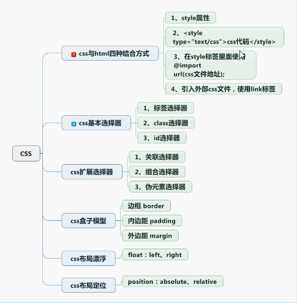

# CSS

#### 1.css 与HTML结合方式
    css文件与HTML分离开，在HTML head 中导入css
    1.在标签中加入css
    2.在head中 
    3.@import 方式，不推荐
    4.链接文件 <link rel="stylesheet" type="text/css" href="css文件路径">
    
#### 2.css基本选择器
     1.标签选择  标签 {css样式}
     div {
     background-color: aquamarine;
     }
     
     2.class选择器 标签.class {css样式}
     #aa {
     background-color: antiquewhite;
     }
     
     3.id选择器 标签.id {css样式}
     .dd {
     background-color: brown;
     }

#### 3.css扩展选择器
    1.关联选择器 标签中的标签 div中的p标签
    div p.p1{
    background-color: yellow;
    }
    
    2.组合选择器 标签组合 div和p都使用一种
    div,p{
    background-color: darkred;
    }
    
    3.伪累选择器
    * 超链接状态
    原始  :link
    悬停  :hover
    点击  :active
    点击之后    :visited
    
    4.盒子模型
    边框 border:2px solid red;
    border-top  border-bottom   border-left border-right
    
    内边距 padding:20px
    padding-top padding-bottom  padding-left padding-right
    
    外边距 margin:20px
    margin-top margin-bottom  margin-left margin-right

    5.布局漂浮
    float   left：后面的div到右边   right：后面的div到左边
    #aa {
    float: left;
    width: 13%;
    }
    
    
    6.布局定位（漂浮）
    position
    absolute   从文档流中拖出
    relative   不会从文档流中拖出
    
    #aa {
    position: absolute;
    margin-top:3%;
    margin-left: 3%;
    height: 3%;
    }

