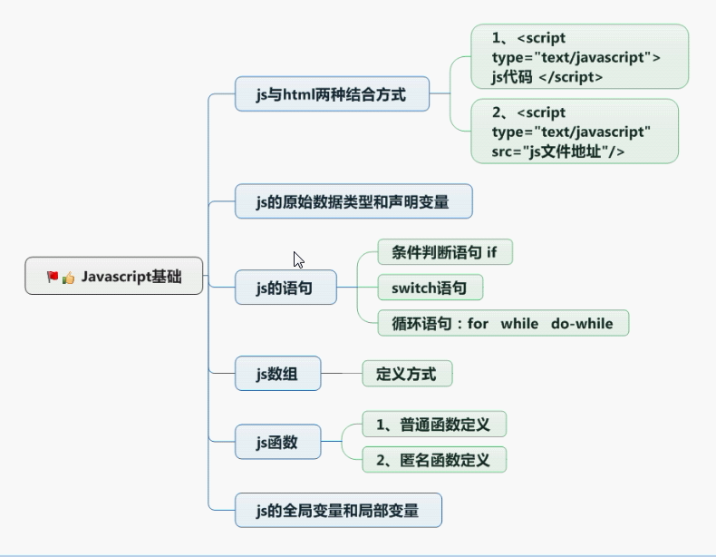

# JS

## 组成
    ECMAScript  语法
    bom         浏览器模型
    dom         文档模型

## 一、ECMAScript
    
#### 1.js和html的结合方式
    1.  
    2.  

####  2.js的数据类型
    string number boolean null undifined
    var定义

####  3.js语句
    if
    swtich
    for
    while
    do-while
    
#### 4. js的运算符
    字符串操作
    + 拼接字符串
    - 执行数学运算
    
    == 和 ===
    == 判断值
    === 判断值和类型
    
####  5.js的数组
    数组定义
    var arr = [1,2,"3"];
    var arr = new Array(9) // 数组长度
    var arr = new Array(1,2,3); // 元素1，2，3
        
####  6.js的函数
    定义方式1:
    function methodName(a,b) {
    
    }
    
    定义方式2:
    var methodName = function(a,b){
    
    }
        
    定义方式3:
    var methodName = new Function("a,b","方法体和返回值");
        
####  7.script标签位置
    放在body后面
    
#### 8. js中的对象使用
    String Array Date Math使用
    
#### 9 .js的全局函数
    1.eval(code) 执行代码字符串
    var code = "alert('哈哈哈');"
    eval(code);
    
    2.url编码解码
    encodeURI()
    decodeURI()
    
    3.判断是否为数字
    isNaN(str);
    
    4.转换字符串为数字
    parseInt(num);
    
#### 10 函数重载
    function add(){
        var num
        for(var i=0 ; i<arguments.length; i++){
            num += arguments[i];
        }
        return num;
    }
    alert(add(1,2,3,4,5));

## 二、bom 浏览器对象模型
    1.navigator属性
     userAgent
     product
     appVersion
     appName
     appCodeName
     language
     systemLanguage
     userLanguage
     mimeTypes
     platform
     plugins
     onLine
     cookieEnabled
    
    2.screen属性
     width
     height （屏幕高度）
     availHeight（出去任务栏的高度）
     availWidth
     pixelDepth
     colorDepth
    
    3.location属性
    href(获取完整的URL路径)(设置跳转地址 location.href="xx.html")
    hash
    port
    host
    hostname
    pathname
    protocol
    search
    target
    reload()
    replace(url)
    
    4.history方法
     back()
     forward()
     go(value) value 1下一个页面 -1上一个页面
    
    5.window对象
     // 窗口处理
     confirm() 确认取消弹框
     prompt()  输入信息弹框
     scrollTo()
     close()
     open()
     alert()
     createPopup()
     // 定时器
     clearInterval()
     clearTimeout()
     setInterval()
     setTimeout()
     opener 获取打开这个window的对象
        
## 三、dom 文档对象模型
        
####  组成：
    
 哈哈哈哈 

    1.document 整个html文档
    2.element 标签属性
    3.文本对象
    
#### 1.document 整个html文档（用于添加节点）
    获取节点
    document.getElementById();
    document.getElementsByClassName();
    document.getElementsByName();
    document.getElementsByTagName();
    
    插入节点
    document.insertBefore()
    
    删除节点
    document.removeChild()
    
    替换节点
    document.replaceChild()
    
    创建节点
    var li = document.createElement("li");
    var text = document.createTextNode("name");
    
    添加节点
    li.appendChild(text);
    
    位置节点
    li.firstChild
    li.lastChild
    li.childNodes 获取所以子节点，兼容性差，使用document.getElementsByTagName()获取
    li.parentNode
    li.nextSibling  指向后面一个兄弟节点
    li.previousSibling  指向前面一个兄弟节点
    
    
    
#### 2.element 标签对象(用于设置标签的属性id、class、name等)
    获取标签属性
    li.getAttribute("id")
    
    设置标签属性
    li.setAttribute("id","100")

    移除标签属性
    li.removeAttribute("id")

#### 3.文本对象
    获取标签
        var p = document.getElementById("idName");
        document.write(p.nodeName);
        document.write(p.nodeValue);
        
    获取属性
        var id = p.getAttributeNode("id");
        document.write(id.nodeName);
        document.write(id.nodeValue);
    
    获取子节点
        var text = p.firstChild;
        document.write(text.nodeName);
        document.write(text.nodeValue);
        
        
## 四、 innerHTML
    var p = document.getElementById("idName");
    p.innerHTML 获取标签中的文本
    p.innerHTML = " aaaaaaa " 设置标签的HTML文本
        
        
    
    
