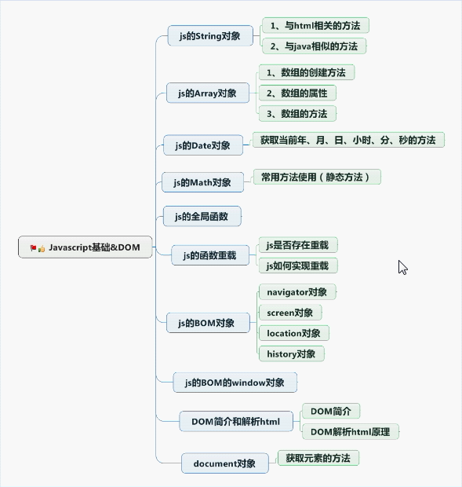

# JS

[TOC]



## 组成
    ECMAScript  语法
    bom         浏览器模型
    dom         文档模型

## 一、ECMAScript

#### 1.js和html的结合方式
    1.  <script type="text/javascript"> js代码 </script>
    2.  <script type="text/javascript" src="js路径"> </script>
    3.  <script src="js路径"> </script>

####  2.js的数据类型
    string number boolean null undifined
    var定义

####  3.js语句
    if
    swtich
    for
    while
    do-while

#### 4. js的运算符
    字符串操作
    + 拼接字符串
    - 执行数学运算
    
    == 和 ===
    == 判断值
    === 判断值和类型

####  5.js的数组
```javascript
// 数组定义
var arr0 = [1,2,"3"];
// 数组长度
var arr1 = new Array(9)
// 元素1，2，3
var arr2 = new Array(1,2,3); 
// 通过下标设置元素
arr1[0] = 1;
arr1[1] = 2;
```

####  6.js的函数
    定义方式1:
    function methodName(a,b) {
    
    }
    
    定义方式2:
    var methodName = function(a,b){
    
    }
        
    定义方式3:
    var methodName = new Function("a,b","方法体和返回值");

####  7.script标签位置
    放在body后面

#### 8. js中的对象使用
```javascript
// String Array Date Math使用
// 字面两创建对象
var person = {
    name:"张三",
    age:10,
    eat:function (){
        console.log("吃饭");
    }
} 
person.eat();
// 点语法访问属性
console.log(person.name);
// 属性访问的另一种方式
console.log(person["name"])
// 遍历对象的属性
for (var key in person){
    console.log(key);
}
```

#### 9 .js的全局函数
    1.eval(code) 执行代码字符串
    var code = "alert('哈哈哈');"
    eval(code);
    
    2.url编码解码
    encodeURI()
    decodeURI()
    
    3.判断是否为数字
    isNaN(str);
    
    4.转换字符串为数字
    parseInt(num);

#### 10 多参数传递

```javascript
function add(){
    var sum = 0;
    for (var i=0;i<arguments.length;i++){
        sum += arguments[i];
    }
    alert(sum);
}

add(100,200,300,400,500,600);
```

####11 函数作为参数使用（用做回调）

#### 12 函数作为返回值使用 


## 二、bom 浏览器对象模型

    1.navigator属性
     userAgent
     product
     appVersion
     appName
     appCodeName
     language
     systemLanguage
     userLanguage
     mimeTypes
     platform
     plugins
     onLine
     cookieEnabled
    
    2.screen属性
     width
     height （屏幕高度）
     availHeight（出去任务栏的高度）
     availWidth
     pixelDepth
     colorDepth
    
    3.location属性
    href(获取完整的URL路径)(设置跳转地址 location.href="xx.html")
    hash
    port
    host
    hostname
    pathname
    protocol
    search
    target
    reload()
    replace(url)
    
    4.history方法
     back()
     forward()
     go(value) value 1下一个页面 -1上一个页面
    
    5.window对象
     // 窗口处理
     confirm() 确认取消弹框
     prompt()  输入信息弹框
     scrollTo()
     close()
     open()
     alert()
     createPopup()
     // 定时器
     clearInterval()
     clearTimeout()
     setInterval()
     setTimeout()
     opener 获取打开这个window的对象

## 三、dom 文档对象模型

####  组成：
    <p id="idName"> 哈哈哈哈 </p>
    1.document 整个html文档
    2.element 标签属性
    3.文本对象

#### 1.document 整个html文档（用于添加节点）
```javascript
// 获取节点
document.getElementById(); // 元素
document.getElementsByClassName(); // list
document.getElementsByName(); 
document.getElementsByTagName(); // list  

// 插入节点
document.insertBefore()

// 删除节点
document.removeChild()

// 替换节点
document.replaceChild()

// 创建节点
var li = document.createElement("li");
var text = document.createTextNode("name");

// 添加节点
li.appendChild(text);

// 位置节点
li.firstChild
li.lastChild
li.childNodes // 获取所以子节点，兼容性差，使用document.getElementsByTagName()获取
li.parentNode
li.nextSibling  // 指向后面一个兄弟节点
li.previousSibling  // 指向前面一个兄弟节点

// 修改节点内容 innerText在火狐低版本浏览器不支持，需要使用textContent
document.getElementsByClassName("xm_a")[0].innerText = "甄姬";
// 设置标签的HTML文本 文本可以为标签
document.getElementById("idName").innerHTML = "<br>aaaaaaa</br>";
```

​    
#### 2.element 标签对象(用于设置标签的属性id、class、name等)
```javascript
<input type="button" value="修改" id="btn" score="100"/>
<script>
    document.getElementById("btn").onclick = function() {
        this.type = "date";
        alert(this.getAttribute("type"));
    }
</script>

// 1.获取，设置标签的属性
document.getElementById("btn").type = "date"; 
document.getElementById("btn").value = "哈哈"; 
document.getElementById("btn").id = "idChange";

// 2.获取修改自定义属性的唯一方式
li.getAttribute("score")
li.setAttribute("score","50")

// 3.移除标签属性
li.removeAttribute("score")

```

#### 3.文本对象
```javascript
// 获取标签
    var p = document.getElementById("idName");
    document.write(p.nodeName);
    document.write(p.nodeValue);
    
// 获取属性
    var id = p.getAttributeNode("id");
    document.write(id.nodeName);
    document.write(id.nodeValue);

// 获取子节点
    var text = p.firstChild;
    document.write(text.nodeName);
    document.write(text.nodeValue);
```

